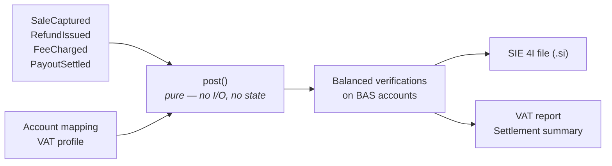

<div align="center">

# Kontera

**Swedish bookkeeping as an embeddable Rust library.**

Commerce events in — balanced BAS verifications and SIE 4I out.
No database, no server.

[](docs/06-roadmap.md)
[](https://www.rust-lang.org/)
[](#license)

</div>

<!-- Add these once the workflow and packages exist:
[](https://github.com/OWNER/kontera/actions/workflows/ci.yml)
[](https://crates.io/crates/kontera)
[](https://docs.rs/kontera)
-->

> [!WARNING]
> **Pre-alpha. Nothing works yet.** The specification is complete and the
> implementation has not started. Watch the repo if the idea is useful to you;
> don't depend on it.

**Contents** ·
[Problem](#the-problem) ·
[What it does](#what-kontera-does) ·
[Who it's for](#who-its-for) ·
[Why it doesn't exist](#why-this-doesnt-already-exist) ·
[Scope](#scope) ·
[Status](#status) ·
[Install](#installation) ·
[Docs](#documentation) ·
[Contributing](#contributing) ·
[Disclaimer](#disclaimer) ·
[Security](#security) ·
[License](#license) ·
[På svenska](#på-svenska)

---

## The problem

A Swedish webshop takes 40 orders on Monday: 50,000 kr including 25% moms. Two
customers return items worth 1,000 kr. Stripe charges 1,168 kr in fees. On
Thursday, one line appears on the bank statement:

**47 832 kr**

That number is everything the bank feed knows about Monday. The bookkeeping it
has to produce is nine postings across five accounts — and afterwards the payment
provider receivable account must be **exactly zero**.

Three things go wrong, and they're all the same mistake:

- **The payout is booked as revenue.** Revenue becomes 47,832 instead of 40,000.
  Fees vanish. Output VAT is understated by roughly 1,600 kr.
- **Timing drifts.** Sales happened Monday, cash arrived Thursday. Across a month
  boundary, the momsdeklaration is wrong.
- **Nothing checks.** There's no assertion that
  `payout = sales - refunds - fees`, so errors accumulate silently until someone
  reconciles by hand at year-end.

## What Kontera does

Converts a commerce event log into correct Swedish bookkeeping — and **refuses to
emit output it can't prove is right**.



The target API — this is what v0.1 will look like, not what runs today:

```rust
use kontera::{post, Config, Event};

let events: Vec<Event> = serde_json::from_str(&log)?;
let config = Config::from_toml(&toml)?;

let ledger = post(&events, &config)?;              // pure. no I/O, no state
let sie    = kontera_sie::write_4i(&ledger, today)?;

std::fs::write("2026-01.si", sie)?;                // hand this to an accountant
```

From Node, via WASM — no sidecar, no container, no network hop:

```js
import { post, writeSie } from 'kontera';

const ledger = post(events, config);
const sie    = writeSie(ledger, '2026-01-31');
```

### Three properties

**It enforces the settlement invariant.** `payout = sales - refunds - fees`. When
that fails you get an `Err` carrying the exact discrepancy, not a plausible
looking wrong answer. Unbalanced verifications are unrepresentable in the type
system — the constructor won't build one.

**It speaks Swedish.** BAS chart of accounts, moms at 25/12/6, EU reverse charge,
OSS, export outside the EU. Output is SIE 4I, the interchange format every
Swedish accounting system accepts.

**It embeds.** One pure core, three shells: a CLI, an npm package via WASM, and
an HTTP sidecar. No integration licence, no external service, no merchant data
leaving the host's server.

## Who it's for

Not merchants — **platform builders**. If you're shipping a Swedish webshop and
want correct bookkeeping inside your own admin panel, plus a clean SIE file for
the merchant's accountant at year-end, that's the gap this fills.

> Stripe gives you payments as a library.
> Nobody gives you Swedish bookkeeping as a library.

## Why this doesn't already exist

Adjacent tools each solve part of the problem:

| Tool | Embeddable | Swedish rules | Settlement-aware | Self-hosted |
| :--- | :---: | :---: | :---: | :---: |
| Formance, TigerBeetle, Blnk | ✅ | ❌ | ❌ | ✅ |
| A2X, Link My Books, Synder | ❌ | ❌ | ✅ | ❌ |
| Fortnox / Visma connectors | ❌ | ✅ | ⚠️ | ❌ |
| Bigcapital | ✅ | ❌ | ❌ | ✅ |
| **Kontera** | ✅ | ✅ | ✅ | ✅ |

Ledger primitives exist but know nothing about moms, BAS or SIE. Swedish
knowledge exists but only inside closed commercial platforms, with connectors
acting as pipes into them.

## Scope

**In:** double-entry ledger on BAS accounts · four VAT scenarios (SE domestic,
EU B2B reverse charge, EU B2C OSS, export) · settlement reconciliation ·
SIE 4I export · CLI, WASM/npm, HTTP sidecar.

**Deliberately out of v0.1:** persistence · HTTP server, auth, multi-tenancy ·
invoicing, PDF, customers, products · Peppol / EN 16931 · bank feeds, camt.053,
PSD2 · multi-currency · kontantmetoden · year-end and NE-bilaga · purchase side
and input VAT · admin UI.

Unsupported scenarios return a typed `ScenarioGap` error rather than a guess, so
the boundary is visible in the output instead of hidden in the books. See
[`docs/01-problem-and-scope.md`](docs/01-problem-and-scope.md).

## Status

| Milestone | Exit criterion | Status |
| :--- | :--- | :--- |
| **M1** Types & balance invariant | An unbalanced verification cannot be constructed | Not started |
| **M2** VAT & posting rules | The worked example produces the exact posting table | Not started |
| **M3** SIE 4I & acceptance | A `.si` imports into Fortnox untouched, incl. `å ä ö` | Not started |
| **M4** Settlement & CLI | A tampered payout always errors with a useful delta | Not started |
| **M5** WASM, npm, first host | A real shop produces a month's SIE via `npm install` | Not started |

M3 is the real gate. If a commercial Swedish system won't import the output,
nothing else matters. Full plan in [`docs/06-roadmap.md`](docs/06-roadmap.md).

## Installation

Not published yet.

```toml
# Cargo.toml — once released
[dependencies]
kontera = "0.1"
kontera-sie = "0.1"
```

```sh
npm install kontera   # WASM build, no native toolchain required
```

## Documentation

The specification is written and binding — worth reading before the code exists.

| Document | Covers |
| :--- | :--- |
| [Problem & Scope](docs/01-problem-and-scope.md) | The problem, non-goals, success criteria |
| [Domain Model](docs/02-domain-model.md) | BAS mapping, VAT scenarios, invariants, glossary |
| [Architecture](docs/03-architecture.md) | Crate layout, the purity boundary, integration shapes |
| [Public API](docs/04-public-api.md) | Event schema, config, error taxonomy, SIE contract |
| [Testing Strategy](docs/05-testing-strategy.md) | Property tests, golden files, the acceptance test |
| [Roadmap](docs/06-roadmap.md) | Milestones, exit criteria, risk register |
| [Release Engineering](docs/07-release-engineering.md) | Versioning, CI, publishing, licensing |
| [Coding Standards](docs/08-coding-standards.md) | Rust conventions for this codebase |
| [ADRs](docs/adr/) | Why the core is pure, why decimals, why SIE 4I, why fail closed |

## Contributing

Too early for feature PRs — the API will churn. What's useful now:

- **Corrections to the accounting.** If a BAS account, VAT scenario or
  momsdeklaration mapping in [`02`](docs/02-domain-model.md) is wrong, please
  open an issue. Anything marked `VERIFY` is explicitly unconfirmed.
- **SIE import experience.** If you've made SIE 4I files that a Swedish system
  accepted or rejected, that knowledge is scarce and valuable.
- **Use cases.** If you're building a Swedish commerce platform, what would you
  need for this to be usable?

Non-negotiable constraints, should you send code: the core is pure (no I/O,
async, `unsafe`, or clock reads), money is `rust_decimal` and never a float, and
domain enums have no `_ =>` arms. See [ADR-0001](docs/adr/0001-pure-core.md) and
[`08`](docs/08-coding-standards.md).

## Disclaimer

Kontera produces accounting data used in filings to Skatteverket. **It is not
accounting or tax advice, and its authors are not accountants or tax advisers.**
Output must be reviewed by a qualified person before it's filed. Default account
mappings and VAT rules are marked `VERIFY` until confirmed by a Swedish
accountant; no release will be tagged before that review happens.

## Security

Kontera has no network surface and no persistence. Its attack surface is the
deserialisation of an event log supplied by the host, which is why `post()` is
required never to panic and why the deserialiser is fuzzed nightly.

If you find a vulnerability, please use
[GitHub's private vulnerability reporting](../../security/advisories/new)
rather than a public issue. Accounting bugs — a wrong posting, a VAT scenario
mishandled — are not security issues; open a normal issue for those.

## License

Licensed under either of

- Apache License, Version 2.0 ([LICENSE-APACHE](LICENSE-APACHE) or
  <https://www.apache.org/licenses/LICENSE-2.0>)
- MIT license ([LICENSE-MIT](LICENSE-MIT) or
  <https://opensource.org/licenses/MIT>)

at your option.

Unless you explicitly state otherwise, any contribution intentionally submitted
for inclusion in the work by you, as defined in the Apache-2.0 license, shall be
dual licensed as above, without any additional terms or conditions.

---

## På svenska

**Kontera** är ett Rust-bibliotek som gör om händelser från en e-handel till
korrekt bokföring: balanserade verifikationer på BAS-konton, moms hanterad per
scenario, och export till SIE 4I som revisorn kan läsa in i Fortnox eller Visma.

Det som saknas i dag är avstämningen mellan **order** och **utbetalning**. En
utbetalning från Stripe eller Klarna är ett nettobelopp som slår ihop många
ordrar minus avgifter och returer. Kontera kräver att
`utbetalning = försäljning - returer - avgifter` stämmer, och vägrar producera
bokföring när den inte gör det.

Biblioteket är inget bokföringsprogram och ersätter inte Fortnox eller Visma. Det
är en byggsten för den som bygger en e-handelsplattform och vill ha rätt bokföring
i sitt eget system.

*<sub>kontera (v.) — att ange vilka konton en affärshändelse ska bokföras på.</sub>*